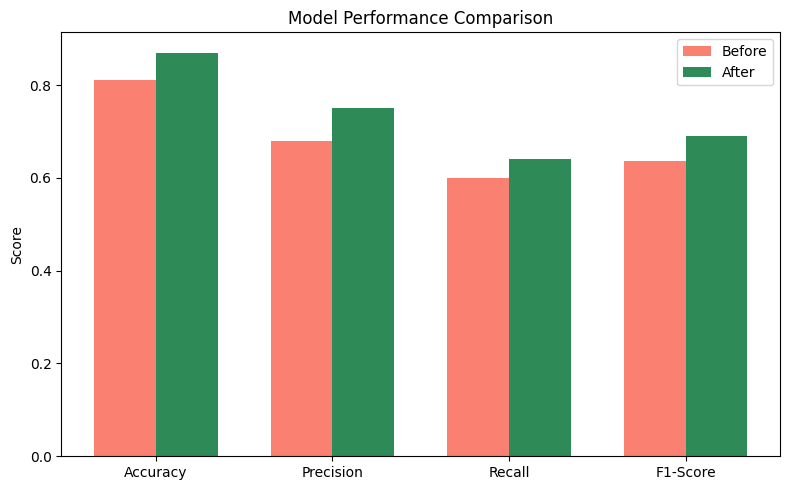

# AI-in-the-Loop: Feedback-Based Retraining Pipeline

This project demonstrates how to build a real-world **AI-in-the-loop system** that continuously improves itself using feedback. The system detects prediction errors, logs corrections, and retrains the model automatically.

**Read the full blog post here →**  
🔗 [AI in the Loop: Building a Feedback-Retraining System That Learns from Mistakes](https://medium.com/@myakalarajkumar1998/ai-in-the-loop-building-a-feedback-retraining-system-that-learns-from-mistakes-13a5761bb042)

---

## Architecture Overview

1. `POST /predict` — Makes and logs predictions (FastAPI)
2. `POST /feedback` — Accepts corrections for wrong predictions
3. `retrain_model.py` — Retrains the model using corrected labels
4. `model.pkl` — Updated model is used for future predictions
5. Optional: Airflow DAG for scheduled retraining
6. Streamlit dashboard for user-friendly interaction

---

## Project Structure
```
ai-feedback-loop/
│
├── api/ # FastAPI app for prediction and feedback
| ├── feedback.py
│ └── main.py
|  
│
├── model/ # Model training + retraining logic
│ ├── train_model.py
│ └── retrain_model.py
│
├── db/ # SQLite schema + database
│ ├── schema.sql
│ └── predictions.db
│
├── dashboard/ # Streamlit frontend app
│ └── app.py
│
├── notebooks/ # Visualizations
│ └── ai_feedback_loop_visuals.ipynb
│
├── requirements.txt # Python dependencies
└── README.md # Project overview
```

---

## How to Run Locally

### 1. Set up the virtual environment

```bash
python -m venv venv
source venv/bin/activate  # or venv\\Scripts\\activate on Windows
pip install -r requirements.txt
```

### 2. Initialize the database
```
sqlite3 db/predictions.db < db/schema.sql
```

### 3. Train the initial model
```
python model/train_model.py
```

### 4. Start the FastAPI server
```
uvicorn api.main:app --reload
```
Docs will be available at: http://localhost:8000/docs

## Retraining Manually
```
python model/retrain_model.py
```

## Visualizations
See /notebooks/ai_feedback_loop_visuals.ipynb for:

### Before/after decision boundary


### Model performance metrics chart 


---

## 👨‍💻 Author

**Raj Kumar Myakala**  
[GitHub](https://github.com/rajkumar160798) • [LinkedIn](https://www.linkedin.com/in/raj-kumar-myakala-927860264/) • [Medium](https://medium.com/@myakalarajkumar1998)

---

## 📄 License

This project is licensed under the [MIT License](LICENSE).

https://www.credly.com/badges/284a45d0-fe3f-4777-9770-e219e32c3c9e/public_url
